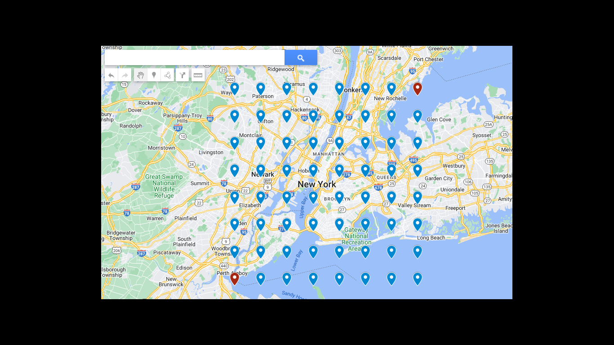

there are two APIS in Google Maps Api project

1.  **[getPlacesByArea](#run-get-places-by-area-api)** Fetches almost all real data(Name, Address, Phone etc) present in Google Maps, in specific area and range provided in request.

2.  **[getRelaventSearchedPages](#run-get-relevent-search-pages-by-area-api)** Fetches all relavent data available on google search pages.


## Run project with below commands
 `npm i & npm start`

***NOTE** It is required to get this [API_KEY](./srGoogleCustomApis.js#L3) to fetch data from Google*
   - Can register one by following [register google maps api/ billing account](https://developers.google.com/maps/documentation/javascript/get-api-key)
   
## Run Get Places By Area API
Make Api call through provided below Get request or paste link in browser Href.
Fill desired data for your search */getPlacesByArea/<**areaName**>/<**keyword**>*

- Variations and settings
   - Can adjust [DESIRED_GRID_LENGTH](./srGoogleCustomApis.js#L12) to increase area coorinates - 60 max *(recomended **8**)*
   - Can adjust [Radius ](./GoogleCustomApis.js#L19) to increase area coorinates - 5000 max *(recomended **2500**)*

   
### Aditional Information About Api
   Api uses below google queries
   -  [maps.googleapis.com/maps/api/geocode/json](./srGoogleCustomApis.js#L31) - Gets list of parameters like  `<address>` as param and returns the geo-location borders of address.
   -  [maps.googleapis.com/maps/api/place/nearbysearch/json](./srGoogleCustomApis.js#L38) - Gets `<location> <radius> <keyword>` as param and returns all the matching results in radius.
   -  [maps.googleapis.com/maps/api/place/details/json](./srGoogleCustomApis.js#L52) - Gets `<placeid>` as param and returns the place detail.


   ### Demo Request and Data Representation

   #### Api's generated coordinates for searching data in each coordinate's radius

   ```Applied settings : {
    DESIRED_GRID_LENGTH: 8,
    radius: 5000
   }
   
   Applied querie : {
    <**areaName**> : new york
   }
   ```

**Visual Representation**
  
  


## Run Get Relevent Search Pages By Area API
Make Api call through provided below Get request or paste link in browser Href.
Fill desired data for your search */getRelaventSearchedPages/<**engine**>/<**search**>/<**limit**>*

Params
-  `<engine>` param will be your google search engine's Id, Get id from [Link](https://programmablesearchengine.google.com/). paste Key at [SEARCH_API_KEY](./srGoogleCustomApis.js#L4)
-  `<search>` it will contain search keyword.
-  `<limit>` limit is to stop search pages by numbers *(e.g 1, 2, 5)*
   
### Aditional Information About Api
   Api uses below google queries
   -  [maps.googleapis.com/customsearch/v1](./srGoogleCustomApis.js#L63) - Gets list of parameters like  `<q> <cx> <start>` as param and returns the google search pages.

*Refferences*
- [custom-search](https://developers.google.com/custom-search/v1/introduction)
- [maps-apis](https://developers.google.com/maps/documentation)